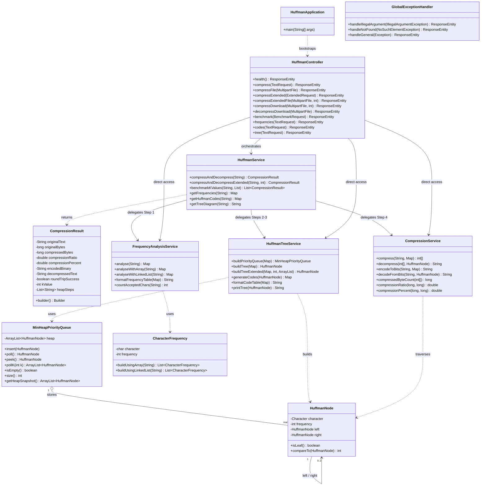

# Huffman Coding Compression System

> Developed by: Mohammad Sheikh Qasem

A Spring Boot REST API that implements the **Huffman Coding** lossless compression algorithm. The project demonstrates core data structures (binary tree, min-heap, linked list) applied to a real compression pipeline, with support for both standard and extended k-pair merging modes.

---

## UML Class Diagram



---

## What is Huffman Coding?

Huffman Coding is a lossless data compression algorithm. It assigns shorter binary codes to more frequent characters and longer codes to less frequent ones, reducing the total number of bits needed to represent the original text.

**Example — input: `"abracadabra"`**

| Character | Frequency | Huffman Code |
|-----------|-----------|--------------|
| a         | 5         | `0`          |
| b         | 2         | `10`         |
| r         | 2         | `110`        |
| c         | 1         | `1110`       |
| d         | 1         | `1111`       |

- Original size: **11 bytes**
- Compressed size: **4 bytes**
- Space saved: **~63%**

---

## Tech Stack

| Technology        | Version |
|-------------------|---------|
| Java              | 17      |
| Spring Boot       | 3.2.0   |
| Maven             | 3.8+    |
| Lombok            | latest  |
| Spring Actuator   | 3.2.0   |

---

## Project Structure

```
huffman/
├── pom.xml
└── src/
    ├── main/
    │   ├── java/com/huffman/
    │   │   ├── HuffmanApplication.java               ← Spring Boot entry point
    │   │   ├── model/
    │   │   │   ├── HuffmanNode.java                  ← Binary tree node
    │   │   │   ├── MinHeapPriorityQueue.java          ← Custom min-heap (array-backed)
    │   │   │   ├── CharacterFrequency.java            ← Frequency model
    │   │   │   └── CompressionResult.java             ← Immutable result value object
    │   │   ├── service/
    │   │   │   ├── FrequencyAnalysisService.java      ← Step 1: character counting
    │   │   │   ├── HuffmanTreeService.java            ← Steps 2-3: tree + code generation
    │   │   │   ├── CompressionService.java            ← Step 3: encode / decode
    │   │   │   └── HuffmanService.java                ← Orchestrates the full pipeline
    │   │   ├── controller/
    │   │   │   └── HuffmanController.java             ← REST API endpoints
    │   │   └── config/
    │   │       └── GlobalExceptionHandler.java        ← Global error handling
    │   └── resources/
    │       ├── application.properties
    │       └── sample_input.txt
    └── test/
        └── java/com/huffman/
            └── HuffmanCodingTests.java                ← 22 tests covering all layers
```

---

## Data Structures Used

| Class                    | Data Structure              | Purpose                              |
|--------------------------|-----------------------------|--------------------------------------|
| `CharacterFrequency`     | `int[]` array (54 slots)    | O(1) frequency counting              |
| `CharacterFrequency`     | `LinkedList`                | Dynamic frequency list               |
| `MinHeapPriorityQueue`   | Binary Min-Heap (ArrayList) | Priority queue ordered by frequency  |
| `HuffmanNode`            | Binary Tree                 | Huffman Tree structure               |
| Code tables              | `LinkedHashMap`             | Maintain insertion order             |

---

## How to Run

### Prerequisites
- Java 17+
- Maven 3.8+

### Build and Start

```bash
cd huffman
mvn clean package -DskipTests
java -jar target/huffman-coding-1.0.0.jar
```

The server starts at `http://localhost:8080`.

### Run Tests

```bash
mvn test
```

---

## REST API Reference

Base URL: `http://localhost:8080/api/huffman`

### Health Check

```
GET /health
```

Returns service status and timestamp.

---

### Standard Compression (JSON text)

```
POST /compress
Content-Type: application/json

{ "text": "abracadabra" }
```

Returns: character frequencies, Huffman codes, encoded binary string, original/compressed byte counts, compression ratio, and the decompressed text (round-trip verification).

---

### Standard Compression (File Upload)

```
POST /compress/file
Content-Type: multipart/form-data

file: <your .txt file>
```

Accepts `.txt` files up to **5 MB**. Returns the same response as `/compress` plus the original file name and size.

---

### Extended Compression — k-pair merging (JSON text)

```
POST /compress/extended
Content-Type: application/json

{ "text": "abracadabra", "k": 2 }
```

Instead of merging one pair per heap iteration, merges `k` pairs at once. Returns the same fields as `/compress` plus `heapSteps` showing the heap state after each iteration.

---

### Extended Compression — k-pair merging (File Upload)

```
POST /compress/extended/file
Content-Type: multipart/form-data

file: <your .txt file>
k: 2
```

---

### Download Compressed File (.huf)

```
POST /compress/download
Content-Type: multipart/form-data

file: <your .txt file>
k: 1   (optional, defaults to 1)
```

Returns a downloadable `.huf` file (JSON format) that stores the frequencies, padding bits, and compressed data — everything needed to reconstruct the original text.

---

### Decompress a .huf File

```
POST /decompress/download
Content-Type: multipart/form-data

file: <your .huf file>
```

Reads the `.huf` file, rebuilds the Huffman Tree from the stored frequencies, and returns the original `.txt` file as a download.

---

### Benchmark Multiple k Values

```
POST /benchmark
Content-Type: application/json

{ "text": "abracadabra", "kValues": [1, 2, 3, 4] }
```

Runs the extended pipeline for each value of `k` and returns a comparison table showing compressed size, compression ratio, and heap iterations for each run.

---

### Frequency Analysis Only

```
POST /frequencies
Content-Type: application/json

{ "text": "hello world" }
```

Returns the character frequency map and a formatted table without running the full compression pipeline.

---

### Huffman Codes Only

```
POST /codes
Content-Type: application/json

{ "text": "hello world" }
```

Returns only the Huffman code table (character → binary string).

---

### Tree Diagram

```
POST /tree
Content-Type: application/json

{ "text": "hello" }
```

Returns an ASCII diagram of the Huffman Tree built from the input.

---

## Extended Algorithm — k-pair Merging

In the standard algorithm, each heap iteration pops **2 nodes**, merges them into one internal node, and pushes it back. The extended version generalizes this:

1. Pop `2k` nodes from the heap
2. Form `k` internal nodes (each is the sum of one pair)
3. Push the `k` new nodes back
4. Repeat until 1 node remains

**Effect:** Larger `k` values reduce the number of heap iterations but may change the tree shape and code lengths. Use the `/benchmark` endpoint to compare the effect of different `k` values on the same input.

---

## Example: Compression Response

**Input:** `"abracadabra"`

```json
{
  "characterFrequencies": { "a": 5, "b": 2, "r": 2, "c": 1, "d": 1 },
  "huffmanCodes": { "a": "0", "b": "10", "r": "110", "c": "1110", "d": "1111" },
  "originalText": "abracadabra",
  "encodedBinary": "010110001011100111101001",
  "originalBytes": 11,
  "compressedBytes": 4,
  "compressionRatio": 2.75,
  "compressionPercent": 63.6,
  "decompressedText": "abracadabra",
  "roundTripSuccess": true,
  "kValue": 1
}
```

---

## Input Constraints

- Accepted characters: `A–Z`, `a–z`, space, comma
- File uploads: `.txt` format only, max **5 MB**
- The `k` parameter must be **≥ 1**
